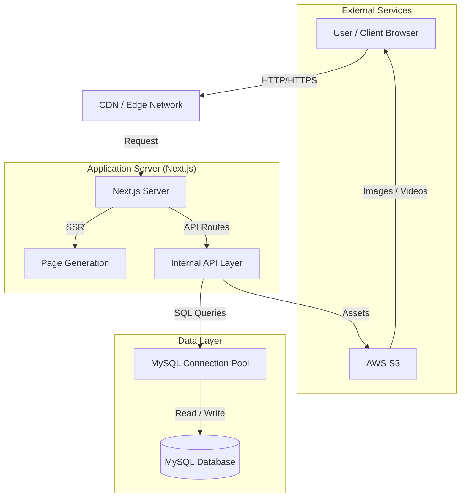

# 🏗 High Level Design (HLD) - MeetOwner

## 1. System Overview

MeetOwner V2 is a web-based real estate platform designed to bridge the gap between property owners and prospective buyers/tenants. The system is built using a **Monolithic Architecture** leveraging the **Next.js** framework, which unifies the Frontend (UI) and Backend (API) into a single deployable unit, optimizing for SEO and development velocity.

## 2. Architecture Diagram

## 3. Core System Components

### A. Client Layer (Frontend)

- **Technology:** React (Next.js 15), Tailwind CSS.
- **Responsibility:** Handles user interaction, state management, and displays data.
- **Rendering Strategy:** Uses **Server-Side Rendering (SSR)** for initial page loads (SEO friendly) and Client-Side Rendering (CSR) for interactive dashboards.

### B. Application Layer (Backend)

- **Technology:** Next.js API Routes (Node.js environment).
- **Responsibility:**
  - Validates requests.
  - Handles business logic (filtering properties, authentication checks).
  - Interfaces with the database.
- **API Pattern:** REST-like endpoints serving JSON data to the frontend widgets.

### C. Data Layer (Database)

- **Technology:** MySQL.
- **Responsibility:** Persistent storage for:
  - User Profiles
  - Property Listings (Details, Metadata)
  - Image References (URLs pointing to S3)
  - User Interactions (Favorites, Contacts)

### D. Asset Storage

- **Technology:** AWS S3 (implied).
- **Responsibility:** Stores high-resolution property images and videos. The database stores the keys/filenames, and the frontend resolves them to full URLs.

## 4. Key Workflows

### 4.1. Viewing Properties (Home Page Load)

1.  **User** requests `collab.meetowner.in`.
2.  **Next.js Server** receives the request.
3.  **Page Component (`page.jsx`)** initiates parallel data fetching (`getLatestProperties`, `getBestDeal`).
4.  **API Handler** executes SQL queries via `lib/server/db.js`.
5.  **Database** returns rows.
6.  **Server** renders HTML with data populated and sends it to User.
7.  **Client** hydrates the page; interactive elements (`Dashboard.jsx`) take over.

### 4.2. Property Listings

- **Search & Filter:** Users can filter by City, Cost, Type, etc.
- **Logic:** The API constructs dynamic SQL queries based on URL search parameters.

## 5. Scalability & Performance

- **Connection Pooling:** Used for MySQL (`mysql2` pool) to handle concurrent database requests efficiently.
- **Caching:** Next.js `force-cache` is used on API calls to reduce database load for static-like data (e.g., "Recommended Sellers").
- **Image Optimization:** Images are served via S3/CDN to offload bandwidth from the main server.
