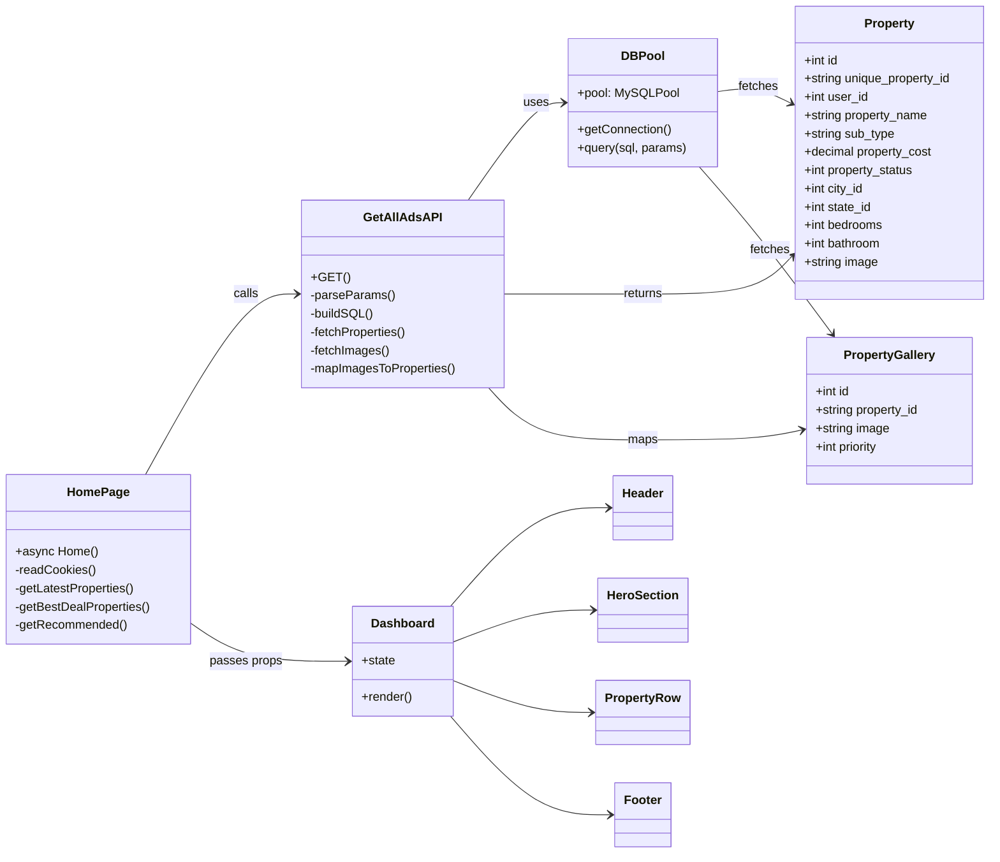

# ⚙️ Low Level Design (LLD) - MeetOwner

## 1. Codebase Structure Strategy

The project follows the **Next.js App Router** convention, enforcing file-system-based routing.

```text
app/
 ├── api/                   # API Routes (Backend Logic)
 │    ├── [featureName]/    # Feature segregation
 │    │    └── route.js     # Method handlers (GET, POST)
 ├── components/            # Client Components (interactive)
 ├── layout.jsx             # Root wrapper (Html, Body)
 └── page.jsx               # Server Component (Data fetching logic)
lib/
 └── server/
      └── db.js             # Singleton Database Connection Pool
```

## 2. Database Design (Schema Schema)

The application uses a **Relational Schema** (MySQL). Key tables inferred from usage:

### 2.1 Table: `properties`

_Stores core property details._

| Column Name            | Type     | Description                                |
| :--------------------- | :------- | :----------------------------------------- |
| `id`                   | INT (PK) | Auto-increment ID                          |
| `unique_property_id`   | VARCHAR  | Public identifier for property (UUID/slug) |
| `user_id`              | INT (FK) | Owner of the property                      |
| `property_name`        | VARCHAR  | Title of the listing                       |
| `sub_type`             | VARCHAR  | e.g., "Apartment", "Villa"                 |
| `property_cost`        | DECIMAL  | Price of the property                      |
| `property_status`      | INT      | Status (1 = Active, 0 = Inactive)          |
| `city_id`, `state_id`  | INT      | Geographic categorization                  |
| `bedrooms`, `bathroom` | INT      | Property specs                             |
| `image`                | VARCHAR  | Filename of the main thumbnail             |

### 2.2 Table: `properties_gallery`

_Stores additional images for a property._

| Column Name   | Type         | Description                              |
| :------------ | :----------- | :--------------------------------------- |
| `id`          | INT (PK)     | Auto-increment ID                        |
| `property_id` | VARCHAR (FK) | Links to `properties.unique_property_id` |
| `image`       | VARCHAR      | S3 filename/key                          |
| `priority`    | INT          | Sort order (1 = Featured)                |

## 3. Backend Module Design

### 3.1 Database Connection (`lib/server/db.js`)

- **Pattern**: Singleton Module.
- **Library**: `mysql2/promise`.
- **Logic**: Checks `global.mysqlPool`. If it doesn't exist, creates a pool with limits (50 connections). This prevents connection exhaustion during Next.js Hot Reloads in development.

### 3.2 API Route: Get All Ads (`app/api/getAllAds/route.js`)

- **Endpoint**: `GET /api/getAllAds`
- **Query Parameters**:
  - `unique_property_id` (optional): Fetches specific property.
  - _Default_: Fetches apartments > 1 Cr (High value), sorted by ID DESC.
- **Logic Flow**:
  1.  Parse `req.url` for params.
  2.  Construct SQL string dynamically.
  3.  `await pool.query(sql)` to get properties.
  4.  Extract IDs and `await pool.query(...)` on `properties_gallery` to get images.
  5.  **In-Memory Mapping**: Iterate images and attach them to corresponding property objects to avoid N+1 query structures (though currently it does 1 fetch + 1 bulk image fetch, which is efficient).
  6.  **Response**: JSON `{ results: [...] }`.

## 4. Frontend Component Hierarchy

### 4.1 Page Composition (`app/page.jsx`)

- **Type**: Server Component (`async function Home()`).
- **Role**: Data Orchestrator.
- **Behavior**:
  - Reads Cookies (`user`) for authentication context.
  - Calls multiple internal APIs in parallel:
    - `getLatestProperties()`
    - `getBestDealProperties()`
    - `getRecommended()`
  - Passes resolved data as _props_ to `<Dashboard />`.

### 4.2 Dashboard Component (`components/Dashboard.jsx`)

- **Type**: Client Component (`"use client"`).
- **Role**: UI Presentation & Interactivity.
- **State**: Manages UI state (modals, sliders, tabs).
- **Children**:
  - `<Header />`: Navigation.
  - `<HeroSection />`: Search bar and banners.
  - `<PropertyRow />`: Reusable slider for property lists.
  - `<Footer />`.

## 5. Security & Best Practices

1.  **SQL Injection Prevention**: Implementation uses **Parameterized Queries** (e.g., `pool.query(sql, params)` where `params` is an array) to sanitize inputs.
2.  **Environment Variables**: Credentials stored in `.env` and accessed via `process.env`.
3.  **Caching**: API calls in `page.jsx` use `cache: "force-cache"` to leverage Next.js Data Cache, reducing repeated hits to the DB for the same content.


