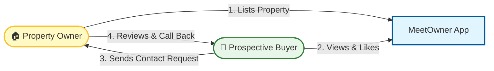
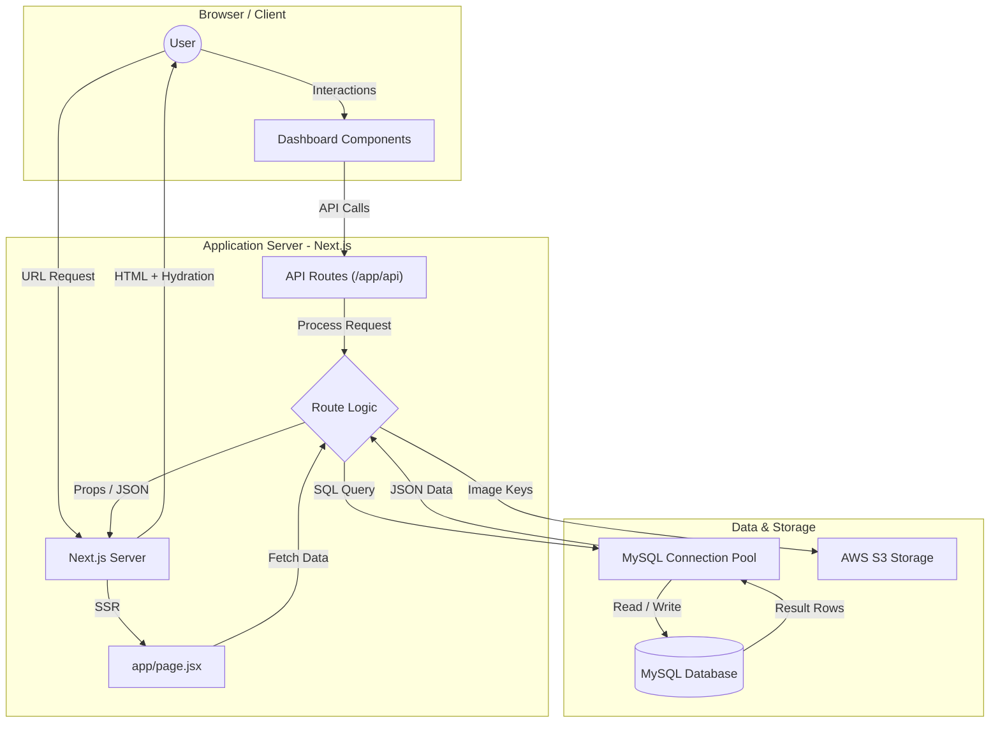

#  MeetOwner - Real Estate Property Selling App

   

Welcome to the **MeetOwner** codebase! This application bridges the gap between property owners and buyers/renters, facilitating direct and seamless real estate transactions.

## 🔄 Product Concept & Flow

Here is a quick overview of how the platform works for our users:



## 🚀 Overview

MeetOwner is a full-stack web application built with **Next.js 15 (App Router)**. It leverages server-side rendering (SSR) for superior SEO and performance, backed by a robust MySQL database architecture accessed via scalable Next.js API routes.

## 🛠 Tech Stack

### Frontend

- **Framework:** Next.js 15 (App Router)
- **Library:** React 19
- **Styling:** Tailwind CSS 4, CSS Modules
- **UI Components:** Radix UI, Lucide React Icons
- **State:** Redux Toolkit, Redux Persist
- **Interaction:** Swiper, React-Slick

### Backend

- **Runtime:** Node.js (Next.js API Routes)
- **Database:** MySQL (managed via `mysql2` connection pool)
- **Storage:** AWS S3 (Property Images)
- **Auth:** Cookie-based Session Management

## 📂 Project Structure

A quick guide to navigating the codebase:

```bash
meetowner-v2/
├── app/                  # Next.js App Router (Core Logic)
│   ├── api/              # Backend API Endpoints (e.g., /api/getAllAds)
│   ├── components/       # Reusable Client Components
│   ├── globals.css       # Global Styles & Tailwind Setup
│   ├── layout.jsx        # Root Layout (HTML/Body Wrappers)
│   └── page.jsx          # Home Page (Server Component & Data Fetching)
├── components/           # Shared UI Layouts (Dashboard, Header, Hero)
├── lib/                  # Backend Utilities
│   └── server/           # Database Configuration (db.js)
├── public/               # Static Assets (Logos, Icons)
└── scripts/              # Maintenance Scripts
```

## ⚡️ Getting Started

Follow these instructions to run the project locally.

### Prerequisites

- Node.js (v18+)
- MySQL Server

### Installation

1.  **Clone the repository**

    ```bash
    git clone https://github.com/meetowner2024/meetowner-v2.git
    cd meetowner-v2
    ```

2.  **Install dependencies**

    ```bash
    npm install
    ```

3.  **Configure Environment**
    Create a `.env` file in the root directory:

    ```env
    # Database
    DB_HOST=address
    DB_USER=dbUser
    DB_PASSWORD=yourpassword
    DB_NAME=databasename
    DB_PORT=dbport

    # App
    NEXT_PUBLIC_BASE_URL=http://localhost:3000
    ```

4.  **Run Development Server**

    ```bash
    npm run dev
    ```

    Visit [http://localhost:3000](http://localhost:3000) to view the app.

## 📐 System Architecture & Data Flow

Below is a detailed view of how the application processes requests, from the user's browser down to the database layer.



### Key Components Illustrated

1.  **Page (`page.jsx`)**: Acts as the data orchestrator, fetching initial content on the server.
2.  **API Routes**: Handle dynamic requests (filtering, contact forms) separate from page loads.
3.  **DB Pool**: A singleton pattern ensures efficient connection management to MySQL.

---

© 2024 MeetOwner. All rights reserved.
